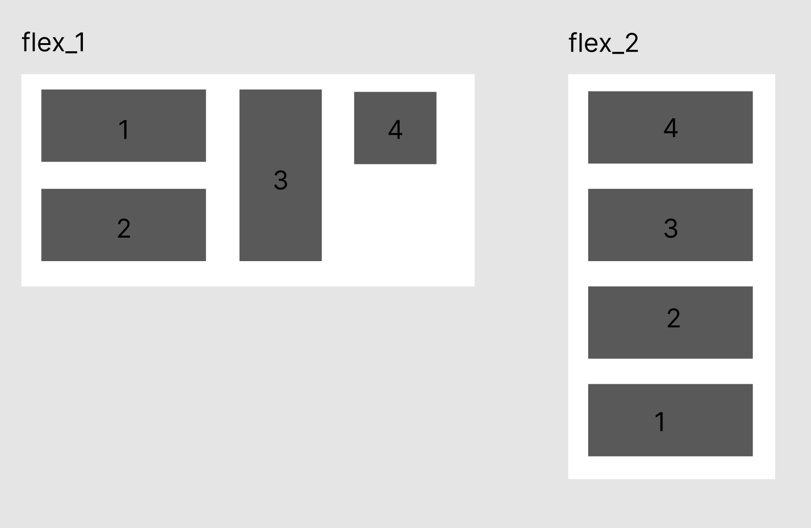
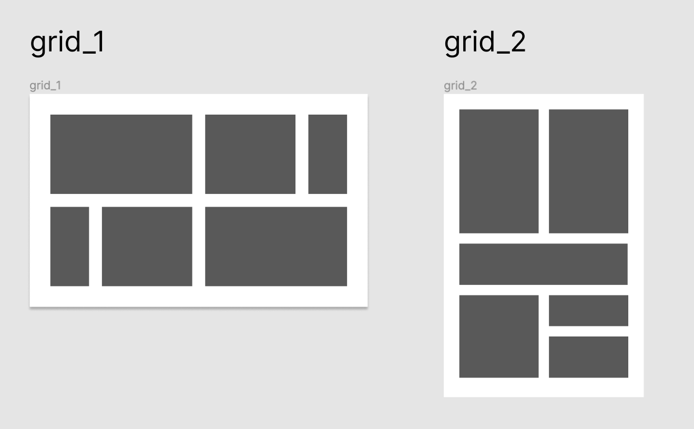

# Lenguajes de marcas: Simulacro 2ªEv

## Enunciado

### 1. Flexbox

En base a la siguiente captura realizar con una **única** mediaquery:

- Pantallas mayores de 700px: flex_1
- Pantallas menores de 700px: flex_2

### 2. Grid

En base a la siguiente captura realizar con una **única** mediaquery:

- Pantallas mayores de 700px: grid_1
- Pantallas menores de 700px: grid_2

